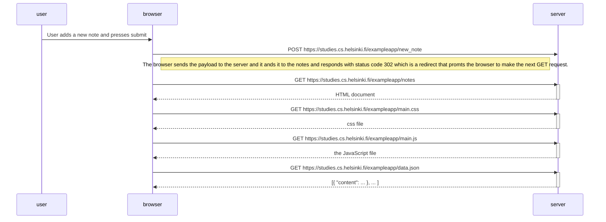

```mermaid
sequenceDiagram
    participant user
    participant browser
    participant server

user->>browser: User adds a new note and presses submit

browser->>server: POST https://studies.cs.helsinki.fi/exampleapp/new_note

Note right of browser: The browser sends the payload to the server and it ands it to the notes and responds with status code 302 which is a redirect that promts the browser to make the next GET request.

browser->>server: GET https://studies.cs.helsinki.fi/exampleapp/notes
    activate server
    server-->>browser: HTML document
    deactivate server

browser->>server: GET https://studies.cs.helsinki.fi/exampleapp/main.css
    activate server
    server-->>browser: css file
    deactivate server

browser->>server: GET https://studies.cs.helsinki.fi/exampleapp/main.js
    activate server
    server-->>browser: the JavaScript file
    deactivate server

browser->>server: GET https://studies.cs.helsinki.fi/exampleapp/data.json
    activate server
    server-->>browser: [{ "content": ... }, ... ]
    deactivate server
```
