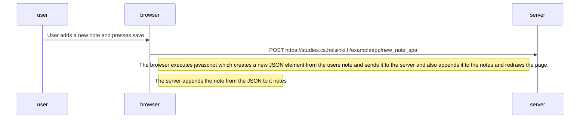

```mermaid
sequenceDiagram
    participant user
    participant browser
    participant server

user->>browser: User adds a new note and presses save

browser->>server: POST https://studies.cs.helsinki.fi/exampleapp/new_note_spa

Note right of browser: The browser executes javascript which creates a new JSON element from the users note and sends it to the server and also appends it to the notes and redraws the page.

Note right of browser: The server appends the note from the JSON to it notes
```
